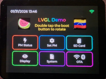
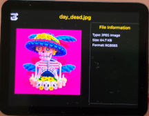
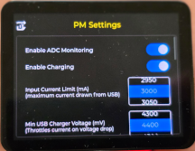

# LilyGo T4-S3 ESP-IDF Starter with BSP-LVGL & HAL

This project is a complete (except for PM Status readings and display), working starter template for the **LilyGo T4-S3** (2.41" AMOLED) development board using **ESP-IDF** and **LVGL**.

It features a robust **Hardware Abstraction Layer (HAL)** that handles the complex low-level drivers for the display, touch screen, and power management IC (PMIC), allowing you to focus on building your application.

## 📸 Gallery




## ✨ Features

*   **Display:** RM690B0 Driver (AMOLED 450x600 via QSPI/SPI-like protocol).
*   **Touch:** CST226SE Driver (Capacitive Touch).
*   **Power:** SY6970 PMIC Driver (Battery charging, voltage monitoring, power path).
*   **HAL Manager:** A unified facade (`hal_mgr`) that simplifies hardware usage.
*   **LVGL Integration:** Pre-configured LVGL 9 display and touch drivers.
*   **Battery Logic:** Smart detection for "No Battery" vs "Charging" states.

## 🚀 Getting Started

### Prerequisites
*   VS Code with Espressif IDF Extension.
*   ESP-IDF v5.x.

### Build & Run
1.  **Open** this folder in VS Code.
2.  **Build** the project: Click the `Build` button in the status bar or run `idf.py build`.
3.  **Flash** to device: Click `Flash` or run `idf.py -p /dev/ttyACM0 flash` (check your port name).
4.  **Monitor** output: Click `Monitor` or run `idf.py monitor`.

## 🛠 Hardware Abstraction Layer (HAL)

The `hal_mgr` acts as a facade. Instead of interacting with the `rm690b0` or `sy6970` drivers directly, your application uses `hal_mgr`.

```c
// main.c example
#include "hal_mgr.h"

void app_main(void) {
    // 1. Initialize all hardware (Screen, Touch, Power)
    hal_mgr_init();

    // 2. Register callbacks for events (Charge status, USB insert, etc.)
    hal_mgr_register_charge_callback(my_charge_handler, NULL);

    // 3. Your app continues...
}
```

## 🧩 Hardware Details & Pin Map

| Signal | GPIO | Notes |
| :--- | :--- | :--- |
| **CS** | 11 | Chip Select |
| **SCK**| 15 | Clock |
| **D0** | 14 | Data 0 |
| **D1** | 10 | Data 1 |
| **D2** | 16 | Data 2 |
| **D3** | 12 | Data 3 |
| **RST**| 13 | Reset |
| **TE** | 18 | Tearing Effect |
| **PMIC_EN** | 9 | **CRITICAL:** Power Enable (Must be HIGH) |
| **I2C_SDA** | 6 | PMIC/Touch I2C |
| **I2C_SCL** | 7 | PMIC/Touch I2C |

## 💡 The Technical "Struggle" (Solved)

This project solves several tricky hardware behaviors of the T4-S3:

1.  **Missing D/C Pin (RM690B0):** The display uses a custom QSPI wrapper protocol instead of standard SPI/8080.
2.  **GPIO 9 Power Enable:** The display and PMIC power rail is controlled by GPIO 9. It must be pulled HIGH or the screen stays black.
3.  **PMIC Watchdog:** The SY6970 watchdog is disabled on boot to prevent random resets.
4.  **No Battery Detection:** Uses a voltage volatility algorithm to detect if the device is running solely on USB (voltage fluctuates) vs Battery (voltage stable).

## 📚 Documentation
*   [LVGL Integration Journey](docs/LVGL_JOURNEY.md)
*   [RM690B0 Rotation Guide](docs/rm690b0_rotation_guide.md)
