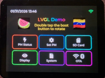
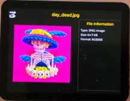
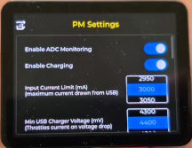

# LilyGo T4-S3 ESP-IDF Starter with BSP-LVGL & HAL

This project is a complete (except Bluetooth implementation), working starter template for the **LilyGo T4-S3** (2.41" AMOLED) development board using **ESP-IDF** and **LVGL**.

It features a robust **Hardware Abstraction Layer (HAL)** that handles the complex low-level drivers for the display, touch screen, and power management IC (PMIC), allowing you to focus on building your application.

## 📂 Repository Structure

**This is the parent HAL/BSP repository.** It contains the core hardware abstraction layer and board support package.

**Related Repository:**

- **[t4-s3_base-apps](https://github.com/coyotegd/t4-s3_base-apps)** - Application examples using this HAL/BSP
  - Contains `external/hal_bsp/` - a synchronized copy of this repository
  - Demonstrates UI applications (launcher, maze game, sports tracker) built on top of the HAL
  - Changes to this parent repository are propagated to the child

**Maintenance:** Both repositories are kept in sync - updates to the HAL, PM Settings, and core functionality are applied to both.

## 🎨 UI Architecture

**Default Home Screen (ui_home):**

This repository provides `ui_home.c` as the default home screen, which displays:

- Time/date display in upper left (shows "http d/t syncing . . ." while synchronizing)
- WiFi status indicator in upper right
- Media player, System Info, PM Settings, PM Status, Display Settings, and System OTA buttons
- Navigation between system screens

**UI Override Pattern:**

Child repositories (like [t4-s3_base-apps](https://github.com/coyotegd/t4-s3_base-apps)) can override the default `ui_home` screen using linker wrapping (`--wrap`):

- Uses `"-Wl,--wrap=ui_home_create"` and `"-Wl,--wrap=show_home_view"` linker flags
- Implements `__wrap_ui_home_create()` to replace the default home screen creation
- Implements `__wrap_show_home_view()` to redirect "home" navigation to custom screens
- Example: `ui_launcher` in t4-s3_base-apps replaces ui_home with a custom launcher screen
- Both screens display "http d/t syncing . . ." during time synchronization
- This allows child projects to customize the main interface while keeping HAL/BSP unmodified

**Benefits:**

- Child repositories can create custom home screens without modifying this HAL/BSP
- Updates to this parent repository don't overwrite custom UIs
- Submodule stays clean and mergeable
- Access to all HAL BSP system screens (PM Settings, Display, OTA, etc.) remains available

## 📸 Gallery





## ✨ Features

- **Display:** RM690B0 Driver (AMOLED 450x600 via QSPI/SPI-like protocol).
- **Touch:** CST226SE Driver (Capacitive Touch).
- **Power:** SY6970 PMIC Driver (Battery charging, voltage monitoring, power path).
- **HAL Manager:** A unified facade (`hal_mgr`) that simplifies hardware usage.
- **LVGL Integration:** Pre-configured LVGL 9 display and touch drivers.
- **Battery Logic:** Smart detection for "No Battery" vs "Charging" states.
- **Development Tools:** ESP-IDF helper script (`tools/idfsh.sh`) for interactive build/flash/monitor workflows.

## 🚀 Getting Started

### Prerequisites

- VS Code with Espressif IDF Extension.
- ESP-IDF v5.x.

### Build & Run

1. **Open** this folder in VS Code.
2. **Build** the project: Click the `Build` button in the status bar or run `idf.py build`.
3. **Flash** to device: Click `Flash` or run `idf.py -p /dev/ttyACM0 flash` (check your port name).
4. **Monitor** output: Click `Monitor` or run `idf.py monitor`.

## 🛠 Hardware Abstraction Layer (HAL)

The `hal_mgr` acts as a facade. Instead of interacting with the `rm690b0` or `sy6970` drivers directly, your application uses `hal_mgr`.

```c
// main.c example
#include "hal_mgr.h"

void app_main(void) {
    // 1. Initialize all hardware (Screen, Touch, Power)
    hal_mgr_init();

    // 2. Register callbacks for events (Charge status, USB insert, etc.)
    hal_mgr_register_charge_callback(my_charge_handler, NULL);

    // 3. Your app continues...
}
```

## 🌐 WiFi & Auto-Timezone

The project includes a robust WiFi Manager (`wifi_mgr`) that handles:

- **Scanning & Connection:** Scans for available networks and manages connection state.
- **SNTP Time Sync:** Automatically fetches UTC time from `pool.ntp.org` upon connection.
- **Auto-Timezone Detection:**
  - After obtaining an IP, the device queries `http://ip-api.com` to determine your location.
  - It parses the specific time zone offset from the JSON response.
  - System `TZ` environment variable is automatically updated to match your local time (e.g., PST/PDT).
  - The UI displays "http d/t syncing . . ." until the valid local time is resolved.

### 🕒 Timekeeping Summary

- **Second-by-second:** Handled by the ESP32's internal software counter (System Time).
- **Accuracy check:** Updated from the internet via SNTP every **60 minutes**.
- **Power Loss:** Since there is no dedicated coin-cell battery RTC, if power is lost completely, time resets until WiFi reconnects.

## 🔌 Understanding USB Type-C on This Device

The device uses a USB Type-C connector for both power delivery and data transfer. It's important to understand how these work:

### USB Power Delivery (USB-PD)

- The SY6970 PMIC is fully capable of working with USB-PD and accepts any voltage the power adapter provides (5V-20V)
- **Hardware Limitation:** The T4-S3 board lacks a dedicated USB-PD controller chip (e.g., FUSB302, CH224K)
- Modern USB-C adapters negotiate voltage automatically through USB-PD protocol
- Without a USB-PD controller, the ESP32-S3 cannot actively request specific voltages
- The device will charge safely at whatever voltage the adapter provides (typically 5V by default)
- **To implement USB-PD control:** Would require adding a USB-PD controller chip to communicate voltage requests

**Current behavior:** Adapter provides voltage → USB-PD negotiation happens in adapter → SY6970 accepts it → Charges battery safely

### USB Data Standards vs. USB Power Delivery

These are **independent** protocols that operate over the same USB Type-C connector:

**USB Data Speed (USB 2.0, 3.0, 4):**

- **USB 2.0** - Up to 480 Mbps (backward compatible, lower power)
- **USB 3.0** - Up to 5 Gbps (faster data transfer)
- **USB 4** - Up to 40 Gbps (latest standard, maximum performance)
- Controls **data transfer speed** only

**USB Power Delivery (USB-PD):**

- Negotiates voltage (5V, 9V, 12V, 15V, 20V) and current
- Controls **charging voltage/current** only
- Independent of USB data version

**Key Point:** A USB 4 connection can work with any USB-PD voltage. You could have "USB 4 data transfer at 40 Gbps" while charging at "5V USB-PD" or "20V USB-PD"—they're separate protocols sharing the same physical connector.

## ⚡ Power Management (PM) Settings & Intelligent Defaults

The system provides comprehensive power management through the **PM Settings** page with intelligent defaults that adapt to your hardware configuration.

### First Boot Behavior (No NVS Settings)

When the device boots for the first time (or after NVS is erased), it uses these practical defaults:

| Setting                 | Default Value | Rationale                                    |
| ----------------------- | ------------- | -------------------------------------------- |
| **Battery Capacity**    | 2000 mAh      | Common capacity for portable devices         |
| **USB Source Type**     | BC1.2 PA 1.5A | Most modern USB ports/chargers support this  |
| **Input Current Limit** | 1500 mA       | Based on BC1.2 standard                      |
| **System Load**         | 350 mA        | ESP32-S3 + AMOLED display + WiFi             |
| **Safety Margin**       | 100 mA        | Prevents USB voltage collapse                |
| **Fast Charge Current** | 1000 mA       | 0.5C for 2000 mAh battery                    |
| **Pre-Charge Current**  | 200 mA        | 0.1C for 2000 mAh battery                    |
| **Termination Current** | 100 mA        | 0.05C for 2000 mAh battery                   |

**Result:** On first boot, the device charges at **1000 mA** (practical and safe for most setups).

### The "PM Defaults" Button: Context-Aware Reset

The **PM Defaults** button in PM Settings applies intelligent defaults that **adapt to your current hardware selection**:

**What it preserves:**

- Your selected **Battery Capacity** (user-defined mAh)
- Your selected **USB Source Type** (e.g., USB 3.0, BC1.2, High-Power PA)

**What it resets:**

- **System Load**: 350 mA
- **Safety Margin**: 100 mA
- **Charging Policy**: 0.5C fast charge, 0.1C pre-charge, 0.05C termination

**Why this matters:**

If you have a **1500 mAh battery** and click "PM Defaults":

- Fast Charge → 750 mA (0.5C for 1500 mAh)
- Pre-Charge → 150 mA (0.1C)
- Termination → 75 mA (0.05C)

If you have a **3000 mAh battery** and click "PM Defaults":

- Fast Charge → 1500 mA (0.5C for 3000 mAh, clamped by USB source)
- Pre-Charge → 300 mA (0.1C)
- Termination → 150 mA (0.05C)

### Adaptive Charging Policy

The system automatically calculates safe charging currents using this formula:

```text
Available Headroom = Input Current Limit - System Load - Safety Margin
Fast Charge Current = min(0.5C × Battery Capacity, Available Headroom)
```

**Example scenarios:**

| USB Source         | ILIM    | System Load | Margin | Available | Battery (2000 mAh) | Result        |
| ------------------ | ------- | ----------- | ------ | --------- | ------------------ | ------------- |
| USB 2.0 (0.5A)     | 500 mA  | 350 mA      | 100 mA | 50 mA     | 0.5C = 1000 mA     | **64 mA**     |
| USB 3.0 (0.9A)     | 900 mA  | 350 mA      | 100 mA | 450 mA    | 0.5C = 1000 mA     | **448 mA**    |
| BC1.2 PA (1.5A)    | 1500 mA | 350 mA      | 100 mA | 1050 mA   | 0.5C = 1000 mA     | **1000 mA** ✓ |
| High-Power PA (3A) | 3000 mA | 350 mA      | 100 mA | 2550 mA   | 0.5C = 1000 mA     | **1000 mA** ✓ |

**Key takeaway:** The system automatically limits charging current based on your USB source to prevent overloading it. If "Limited by source" appears on PM Status, select a more powerful USB source in PM Settings.

### PM Status Page: Real-Time Monitoring

The **PM Status** page displays actual values using a clean table layout:

```text
System Volts:          4500 mV
Battery Volts:         3850 mV
Charge Status:         Fast Charge
Charging Current:      1000 mA
Pre-Charge:            200 mA     (settings value, not ADC)
Termination:           100 mA     (settings value, not ADC)
USB:                   Connected
USB Volts:             5100 mV
USB Power:             Yes
Temperature:           45% - NORMAL
Fault:                 None (LED off) no USB
```

**Label Layout:** Each field shows description (left-aligned) and value (right-aligned) on the same line for easy reading.

**Note:** Pre-Charge and Termination display the configured settings values (read from the PMIC registers), not live ADC readings, since they only apply during those specific charging phases.

### User Workflow

**Initial Setup:**

1. Boot device (uses BC1.2 1.5A defaults)
2. Navigate to **PM Settings**
3. Select your actual **Battery Capacity**
4. Select your actual **USB Source Type**
5. Click **PM Defaults** to calculate optimal charging currents
6. Fine-tune if needed (advanced users)

**Settings are persistent** - stored in NVS and restored on every boot.

### Safety Features

- **Source Protection:** Charging current automatically clamped to prevent USB voltage collapse
- **Battery Protection:** Charge voltage defaults to 4.208V (safe for LiPo/Li-ion)
- **No Battery Detection:** System detects battery disconnect and stops charging
- **Temperature Monitoring:** NTC sensor provides real-time temperature status with color-coded warnings
- **Fault LED:** Blinks at 1Hz when faults detected (can be disabled during fault conditions)

## 🎥 AVI Video Playback

The system includes a video player for `.avi` files stored on the SD card.

- **Frame Rate:** Video playback is optimized for **~15 FPS**. Increasing the frame rate beyond this provides no visual benefit on this screen/interface and only consumes extra resources.
- **Codec:** The player expects **MJPEG inside an AVI container** (Motion JPEG: each frame is a standalone JPEG). Inter-frame codecs like H.264 are not supported.
- **Documentation:** See [docs/avi_mjpeg_lvgl.md](docs/avi_mjpeg_lvgl.md) for detailed implementation guide, FFmpeg conversion commands, and API reference.

## 📡 Over-The-Air (OTA) Updates

The system supports wireless firmware updates via the **System OTA** menu.

- **Logic:**
  - Checks a remote GitHub Release URL for the latest `firmware.bin`.
  - Parses the **Version** string (e.g., `v1.2.0`) from the new binary header.
  - **Anti-Downgrade:** Only updates if the remote version is strictly *higher* than the current running version.
  - **Up-To-Date:** If version is same or older, displays "System is Up To Date".
- **Partitioning:** Uses an A/B partition scheme (`ota_0`, `ota_1`) with an `otadata` manager to switch safe slots automatically.
- **Safety:** Automatically verifies image header before writing and reboots upon success.

## 📂 Project Structure

## 🧩 Hardware Details & Pin Map

**Quick Reference:**

| Signal      | GPIO | Notes                                      |
| ----------- | ---- | ------------------------------------------ |
| **CS**      | 11   | Display Chip Select                        |
| **SCK**     | 15   | Display Clock                              |
| **D0**      | 14   | Display Data 0 (SDA in single-line mode)   |
| **D1**      | 10   | Display Data 1                             |
| **D2**      | 16   | Display Data 2                             |
| **D3**      | 12   | Display Data 3                             |
| **RST**     | 13   | Display Reset                              |
| **TE**      | 18   | Display Tearing Effect                     |
| **PMIC_EN** | 9    | **CRITICAL:** Power Enable (Must be HIGH)  |
| **I2C_SDA** | 6    | PMIC/Touch I2C Data                        |
| **I2C_SCL** | 7    | PMIC/Touch I2C Clock                       |

**Complete Hardware Documentation:** See [docs/t4s3_pinout_guide.md](docs/t4s3_pinout_guide.md) for comprehensive pinout information including:

- All GPIO assignments by component (Display, Touch, SD Card, Flash, PMIC)
- Power distribution and voltage rails
- Expansion header pinout (2×15 pins)
- Component reference (ICs, connectors, buttons)
- Pin conflict warnings and shared buses
- Firmware configuration examples

## 💡 The Technical "Struggle" (Solved)

This project solves several tricky hardware behaviors of the T4-S3:

1. **Missing D/C Pin (RM690B0):** The display uses a custom QSPI wrapper protocol instead of standard SPI/8080. See [docs/rm690b0.md](docs/rm690b0.md) for protocol details.
2. **GPIO 9 Power Enable:** The display and PMIC power rail is controlled by GPIO 9. It must be pulled HIGH or the screen stays black. See [docs/t4s3_pinout_guide.md](docs/t4s3_pinout_guide.md#pin-conflict-warnings).
3. **PMIC Watchdog:** The SY6970 watchdog is disabled on boot to prevent random resets. See [docs/sy6970.md](docs/sy6970.md) for register configuration.
4. **No Battery Detection:** Uses a voltage volatility algorithm to detect if the device is running solely on USB (voltage fluctuates) vs Battery (voltage stable).

## 📚 Documentation

### Hardware Documentation

- **[Complete Pinout Guide](docs/t4s3_pinout_guide.md)** - Comprehensive pin assignments, power distribution, and component reference
- **[RM690B0 Display Driver](docs/rm690b0.md)** - AMOLED display implementation, QSPI protocol, rotation handling, and command reference
- **[CST226SE Touch Driver](docs/cst226se.md)** - Hynitron capacitive touch controller configuration and debugging
- **[SY6970 PMIC Guide](docs/sy6970.md)** - Battery management IC documentation, I2C register map, and charging algorithms

### Software Integration

- **[LVGL Integration](docs/lvgl.md)** - LVGL 9 setup, display/touch driver integration, and performance tuning
- **[AVI/MJPEG Video Playback](docs/avi_mjpeg_lvgl.md)** - Video decoder implementation, FFmpeg conversion guide, and API reference

### Hardware Datasheets

- **[Board Schematic](docs/T4-S3-240719.pdf)** - Official LilyGo T4-S3 schematic (PDF)

## 🔧 Troubleshooting: Hardcoded Paths in Cloned Repos

If cloning this or similar ESP‑IDF projects fails to build or flash due to paths/ports, it’s usually because workspace settings include user‑specific absolute paths.

### Symptoms

- Build refers to another user's `esp-idf` install.
- Flash/monitor tries a non‑existent serial port (e.g., `/dev/ttyACM0`).
- Language server (`clangd`) errors about missing toolchain binaries.

### Quick Fix

- Move aside their workspace settings: `mv .vscode .vscode.bak`
- Reconfigure the project:

```bash
idf.py fullclean
idf.py set-target esp32s3
idf.py reconfigure
idf.py build
```

- Select a valid port when flashing:

```bash
idf.py -p /dev/ttyUSB0 flash monitor
```

### Recommended Repo Practices

- Avoid committing user‑specific `.vscode/settings.json` entries:
  - `idf.espIdfPath`, `idf.toolsPath`, `idf.port`, `clangd.path`
- Prefer workspace‑relative paths:
  - `clangd.arguments: --compile-commands-dir=${workspaceFolder}/build`
- Track `sdkconfig.defaults`, ignore `sdkconfig` to let each machine generate its own.

### First‑Time Setup

- Ensure ESP‑IDF tools are installed via the VS Code extension or by sourcing your local IDF (`. $IDF_PATH/export.sh`).
- Initialize submodules:

```bash
git submodule update --init --recursive
```

---

### VS Code Workspace Settings

This repo includes [.vscode/settings.json](.vscode/settings.json) for convenience.

- Some settings are workspace-portable (e.g. `idf.buildPath`, `clangd.arguments`).
- Some settings may be machine-specific (e.g. a fixed `idf.port`, `idf.currentSetup`, USB adapter location).

If you plan to share changes, consider removing machine-specific values before committing so others can clone/build without editing settings.

## 🔬 Technical Notes

### LVGL JPEG Support Configuration

This project enables LVGL's libjpeg-turbo wrapper (`CONFIG_LV_USE_LIBJPEG_TURBO=y`) and wires libjpeg-turbo in via managed components.

To keep managed components pristine, the build glue is done **project-side** in [main/CMakeLists.txt](main/CMakeLists.txt):

- Depends on the managed component `espressif/libjpeg-turbo` (see [main/idf_component.yml](main/idf_component.yml)).
- Links the LVGL component target against `idf::espressif__libjpeg-turbo` so LVGL can find `jpeglib.h`.
- Adds include paths for internal headers LVGL may include (`jpegint.h`, `jconfigint.h`).

If this ever regresses, the missing-header error usually tells you what include path is needed. The troubleshooting flow is documented in [docs/avi_mjpeg_lvgl.md](docs/avi_mjpeg_lvgl.md).

**Note:** This uses standard libjpeg API (not TurboJPEG), as the TurboJPEG API is not ESP32-S3 compatible.

## 🤝 Contributing

Contributions are welcome! Please:

1. Check existing documentation in [docs/](docs/) before asking questions
2. Test changes on actual hardware when possible
3. Update relevant documentation for hardware or driver changes
4. Follow the existing code style and HAL patterns
